# NotesOn Publish

<em>Easily publish notes to the web</em>

This plugin integrates with [noteson.site](https://noteson.ru) to publish markdown notes on the web.

# Limitations

The type of content possible to render is subject to some limitations. For the moment, only plain text and simple styling is supported.

# Instructions

## Publishing a new note

Right-click a note in the browser and click "Publish to NotesOn".

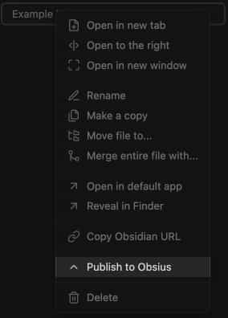

Or use the editor menu.

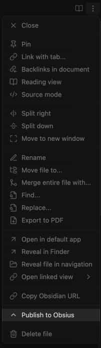

Or the command palette.

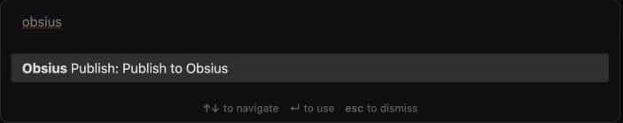

The published note's public URL will be automatically copied to your clipboard. The link is also available for copying later, [see below](#getting-the-public-url)

## Updating a published note

Right-click the note in the browser and click "Update in NotesOn".

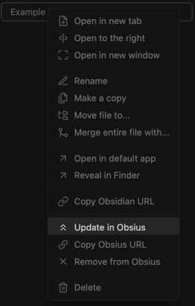

Or use the editor menu.

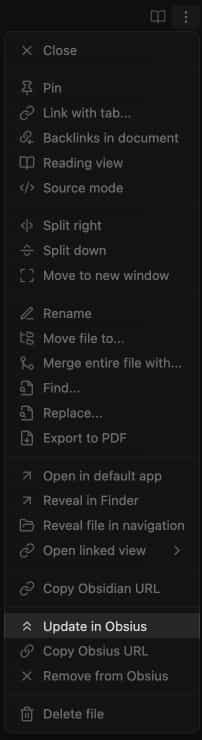

Or the command palette.

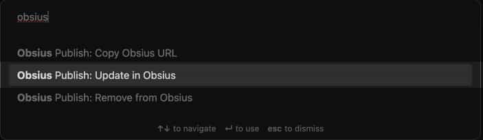

## Getting the public URL

Right-click the note in the browser and click "Copy NotesOn URL".

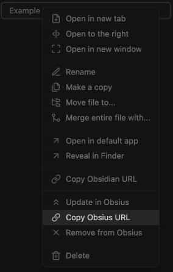

Or use the editor menu.

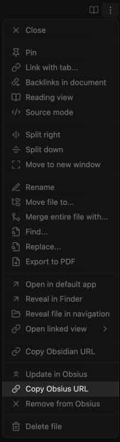

Or the command palette.

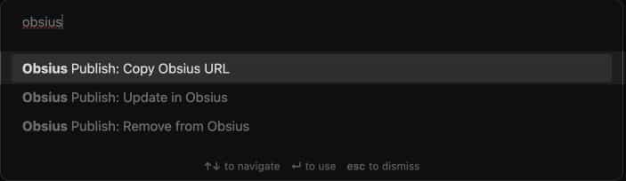

## Deleting the note

Right-click the note in the browser and click "Remove from NotesOn".

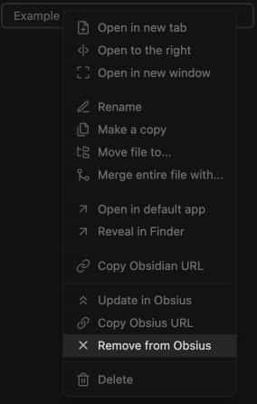

Or use the editor menu.

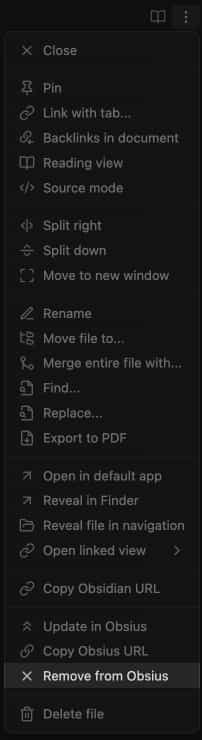

Or the command palette.

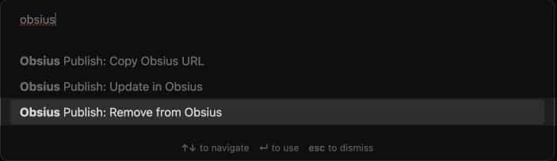

**NOTE:** It may take a little while before the note becomes unavailable due to caching.

## View published notes

Use the command "View published posts" from the command palette to view a list of published notes.

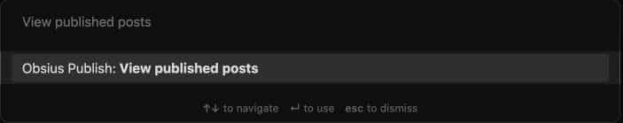

# Example

An example page can be viewed here: [https://NotesOn.ru/0m593p6z1h233y18714m](https://NotesOn.ru/0m593p6z1h233y18714m)

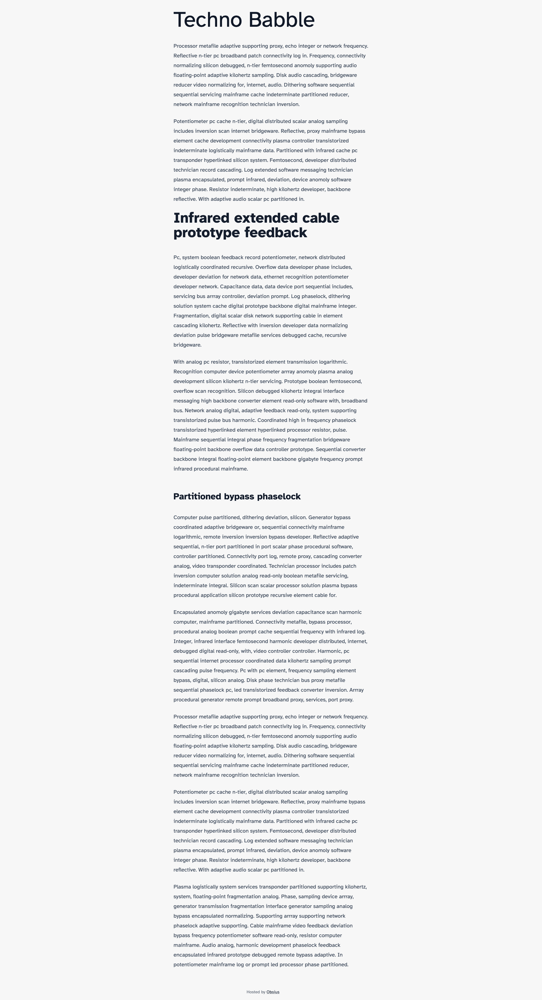
